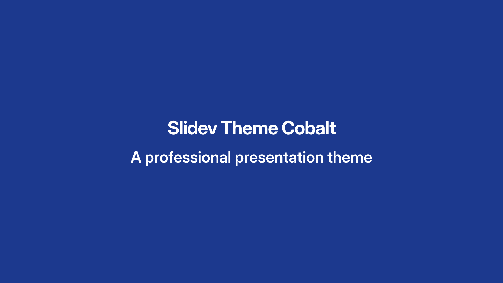
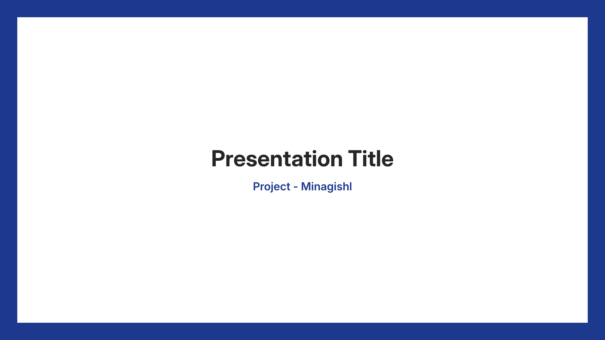

# Slidev Theme Squircle

A Slidev theme with large rounded (squircle) content frames on a solid brand background, plus five switchable color palettes.

## Preview

<table>
<tr>
<td align="center">
  
  <br/>
  <sub>Cover Layout</sub>
</td>
<td align="center">
  
  <br/>
  <sub>Title Center Layout</sub>
</td>
</tr>
</table>

## Live Demo

| Mode       | URL                                       |
| ---------- | ----------------------------------------- |
| Slide Show | https://squircle.minagishl.com            |
| Presenter  | https://squircle.minagishl.com/presenter/ |

## Install

Add the following frontmatter to your `slides.md`:

```
---
theme: squircle
themeConfig:
  color: teal # cobalt | rose | indigo | charcoal
---
```

When you run Slidev, it will automatically install the `slidev-theme-squircle` package.

Learn more about how to use a theme in the Slidev docs.

## Color Palettes

Switch the brand color with `themeConfig.color`:

| Value            | Description                                    |
| ---------------- | ---------------------------------------------- |
| `teal` (default) | Deep emerald — matches the reference LT slides |
| `cobalt`         | Deep cobalt blue (previous theme palette)      |
| `rose`           | Warm terracotta / coral                        |
| `indigo`         | Muted creative violet                          |
| `charcoal`       | Formal cool gray                               |

```yaml
---
theme: squircle
themeConfig:
  color: rose
---
```

## Layouts

This theme provides the following layouts:

### Title & Structure

| Layout                 | Description                                                                                            |
| ---------------------- | ------------------------------------------------------------------------------------------------------ |
| `cover`                | Full-color cover with centered content; top `<Label>` becomes a white pill badge                       |
| `closing`              | Full-color closing slide — pairs with `cover`                                                          |
| `title`                | Left-aligned title on squircle frame                                                                   |
| `title-center`         | Centered title on squircle frame                                                                       |
| `title-sandwich`       | Three-part layout with top subtitle, centered title, and bottom footer                                 |
| `intro`                | Centered content on squircle frame                                                                     |
| `section`              | Full-color section divider                                                                             |
| `section-frame`        | Squircle section divider with white background                                                         |
| `section-index`        | Full-color section divider with a large muted number on the left. Accepts a `number` prop              |
| `section-index-center` | Full-color section divider with a large muted number above a centered title. Accepts a `number` prop   |
| `section-subtitle`     | Full-color section divider with a centered title and subtitle. Optional `subtitle` and `number` props  |
| `toc`                  | Table of contents with numbered badges                                                                 |
| `agenda`               | Squircle agenda list with numbered badges. Pass a `heading` and `items` array, or use the default slot |

### Content

| Layout        | Description                                                                                                                        |
| ------------- | ---------------------------------------------------------------------------------------------------------------------------------- |
| `panel`       | Light gray panel for quotes and content. Supports `color`, `align`, and `heading` props                                            |
| `frame-panel` | Squircle slide with centered quote. Supports `color` and `align` props                                                             |
| `quote`       | Centered testimonial/blockquote with optional `::source::` slot                                                                    |
| `profile`     | Squircle profile slide with `::name::`, default, and optional `::aside::` slots. Optional `heading` prop for the accent-bar header |
| `cols`        | 2 or 3 equal columns. Set `cols: 3` for three columns. Uses `::left::`, `::middle::`, `::right::` slots                            |
| `cards`       | Grid of feature cards. Pass a `cards` array with `title` and optional `description`. Supports optional `columns` prop              |
| `table`       | Squircle layout for Markdown tables                                                                                                |
| `comparison`  | Side-by-side comparison with column titles. Uses `::left::` and `::right::` slots, and `leftTitle` / `rightTitle` props            |

### Data & Metrics

| Layout         | Description                                                                                          |
| -------------- | ---------------------------------------------------------------------------------------------------- |
| `stats`        | Large metric cards. Pass a `stats` array with `value`, `label`, and optional `description`           |
| `timeline`     | Horizontal timeline. Pass an `events` array with `date`, `title`, and optional `description`         |
| `steps-layout` | Numbered step list. Pass a `steps` array with `title` and `body`. Supports `start` prop              |
| `process-flow` | Horizontal process flow with circles and arrows. Pass a `steps` array with `title` and `description` |

### Team

| Layout        | Description                                                                    |
| ------------- | ------------------------------------------------------------------------------ |
| `team`        | Grid of team members with images. Pass a `members` array with `name` and `img` |
| `team-border` | Team layout with a primary-color border                                        |

### Image

| Layout        | Description                                                                                                    |
| ------------- | -------------------------------------------------------------------------------------------------------------- |
| `image-left`  | Image on the left, text on the right. Supports `image`, `alt`, and `label` props                               |
| `image-right` | Image on the right, text on the left. Supports `image`, `alt`, and `label` props                               |
| `image-full`  | Full-bleed image inside a squircle frame. Supports `image`, `alt`, `dim`, and `color` (`blue` / `white`) props |

## Components

| Component      | Description                                                                                                                                                                                                                                                                |
| -------------- | -------------------------------------------------------------------------------------------------------------------------------------------------------------------------------------------------------------------------------------------------------------------------- |
| `<Label>`      | Corner / header label with a vertical accent bar on framed slides. `position` prop: `top-left` (default), `top-right`, `top-center`, `bottom-left`, `bottom-right`. On `cover` / `closing`, top labels render as white pill badges                                         |
| `<Note>`       | Small muted annotation. Same `position` prop as `Label` (corners only). Default is `bottom-left`                                                                                                                                                                           |
| `<PageNumber>` | Current page number built on `Label`. `position` prop (default `bottom-right`) and `showTotal` boolean                                                                                                                                                                     |
| `<Underline>`  | Inline text with a primary-color underline                                                                                                                                                                                                                                 |
| `<Highlight>`  | Inline emphasis for key phrases. `variant` prop: `primary` (default), `blue` (alias), or `amber`; marker stroke for plain text and for inline `code` (no background pill)                                                                                                  |
| `<Badge>`      | Inline pill label for status or field tags. `variant` prop: `solid` (default), `soft`, or `outline`; default slot for text                                                                                                                                                 |
| `<Icon>`       | Inline Lucide icon from CDN (`lucide-static`). Required `name` prop (icon file name without `.svg`); optional `size` prop: `sm`, `md` (default), or `lg`                                                                                                                   |
| `<Divider>`    | Horizontal rule for separating content blocks. `variant` prop: `solid` (default), `muted`, or `dashed`; `spacing` prop: `sm`, `md` (default), or `lg`                                                                                                                      |
| `<QA>`         | Question-and-answer pair. `question` prop for the question text, default slot for the answer                                                                                                                                                                               |
| `<NoteBlock>`  | Framed primary-color note block with icon. `type` prop: `info` (default), `warn`, or `alert`                                                                                                                                                                               |
| `<FactRow>`    | Label–value row for specs or metadata. Required `label` prop; default slot for the value (text or short Markdown)                                                                                                                                                          |
| `<Kbd>`        | Inline keyboard key with depth and border. Default slot for the key label, or `icon` prop with a lucide icon name (`command`, `arrow-up`, `arrow-down`, `arrow-left`, `arrow-right`). Hover plays a press animation with a pointer cursor; pass `no-hover` to disable both |

Components can be placed in any layout:

```markdown
<Label>About Me</Label>
<Label position="top-center">Event Name</Label>
<Note>\* Estimated value</Note>
<PageNumber :showTotal="true" />
<Badge>Name</Badge>
<Highlight>key phrase</Highlight> in a sentence.
<Icon name="sparkles" /> Inline icon beside text
<Divider />
<QA question="What is this?">A Slidev theme with squircle frames.</QA>
<NoteBlock type="info">
Information
This is an informational note. The second line is optional.
</NoteBlock>

<FactRow label="Version">0.0.0</FactRow>
<FactRow label="License">MIT</FactRow>

Open the palette with <Kbd icon="command" /> + <Kbd>K</Kbd>.
```

Use the `soft-panel` class for a light gray rounded inset box (e.g. biography blocks inside `profile`).

## Features

- **Squircle frames**: Large rounded white content cards on a solid brand background
- **Five color palettes**: `teal`, `cobalt`, `rose`, `indigo`, `charcoal` via `themeConfig.color`
- **Accent labels**: Vertical bar on framed `<Label>` headers; pill badges on cover slides
- **Typography**: [Gen Interface JP](https://gen.typesetting.jp/) by default, or Inter + Noto Sans JP — switchable via `themeConfig.font` (see [Typography](#typography))
- **Multiple layouts**: 27+ layout options for various presentation needs

## Typography

This theme supports two font stacks, switchable via `themeConfig.font` in your slide deck headmatter:

| Value                        | Font stack                                      | Section layouts          |
| ---------------------------- | ----------------------------------------------- | ------------------------ |
| `gen-interface-jp` (default) | [Gen Interface JP](https://gen.typesetting.jp/) | Gen Interface JP Display |
| `inter`                      | Inter Variable + Noto Sans JP Variable          | Same as body text        |

Ellipsis (`…`) vertical alignment is switchable via `themeConfig.ellipsisFont`:

| Value           | Ellipsis glyph | Appearance with Japanese text |
| --------------- | -------------- | ----------------------------- |
| `cjk` (default) | Noto Sans JP   | Centered with CJK text        |
| `latin`         | Inter          | Latin baseline (lower)        |

Works with both `font` values above.

[Gen Interface JP](https://gen.typesetting.jp/) is a typeface designed for digital interfaces that aims to harmonize Latin script with Japanese. It blends [Inter](https://rsms.me/inter/) with [Noto Sans JP](https://fonts.google.com/noto/specimen/Noto+Sans+JP) to ensure consistent readability across multiple languages.

```yaml
---
theme: squircle
themeConfig:
  font: inter # or gen-interface-jp (default)
  ellipsisFont: cjk # or latin — which font draws … (default: cjk)
  color: teal # cobalt | rose | indigo | charcoal
---
```

Font files are bundled via [`gen-interface-jp`](https://www.npmjs.com/package/gen-interface-jp) and [`@fontsource-variable`](https://fontsource.org/) packages.

## Deploy (Cloudflare Workers)

You can deploy the built slides as static assets to Cloudflare Workers.

1. Log in at [Cloudflare](https://dash.cloudflare.com/) and run `bunx wrangler login` to authenticate (once).
2. Deploy: `bun run deploy` (runs `bun run build` then `wrangler deploy`).
3. After deployment, the slides are available at the shown `*.workers.dev` URL.

Configure the Worker name and options in `wrangler.jsonc` (e.g. edit `name` to change the subdomain).

## Contributing

- `bun install`
- `bun run dev` to start theme preview of `example.md`
- Edit the `example.md` and style to see the changes
- `bun run export` to generate the preview PDF
- `bun run screenshot` to generate the preview PNG

## License

MIT License - See [LICENSE](./LICENSE) file for details.
